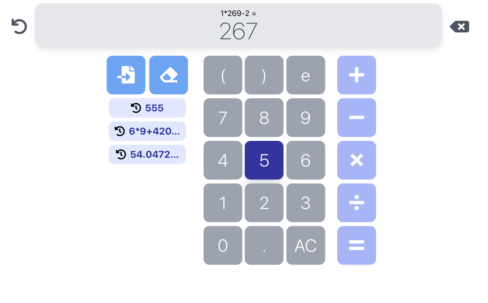
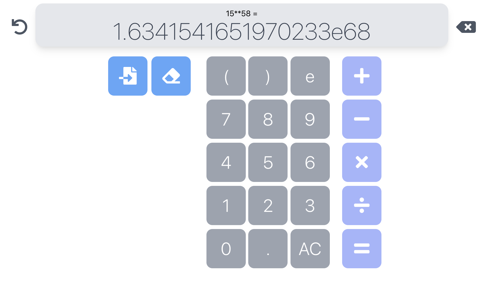
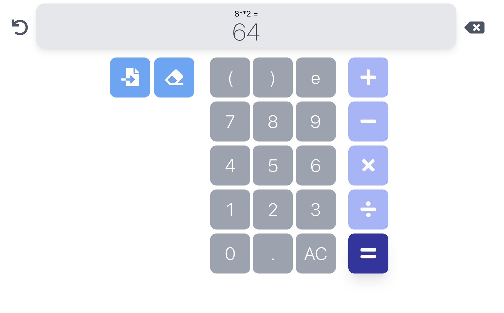

# wp1101-hw5
## 參考
- 介面：自己設計。
- 功能：參考 Android 部分的計算機，可以在輸入完算式之後直接計算。

## 基本要求
- 加減乘除
- 浮點數運算（針對小數點輸入有做限制）
- 如果輸入錯誤，會在計算結果及上方顯示錯誤訊息
    

## 進階要求
- ⽀援輸入錯誤可以有修正鍵
- ⽀援記憶功能，可 store, recall, clear 及顯示記憶的數字或算式
  
- ⽀援切換成科學符號表⽰ （位數大於 9 位時）
  
- 實現加減乘除以外的計算功能
  - 按兩次乘 （＊＊）可以計算次方。
    
  - 括號功能。
    
  - 輸入 e 可使用科學記號計算。
  - 計算結果上方會顯示剛才輸入的算式。
  - 有回復鍵，可以回到算式重新編輯後計算。
